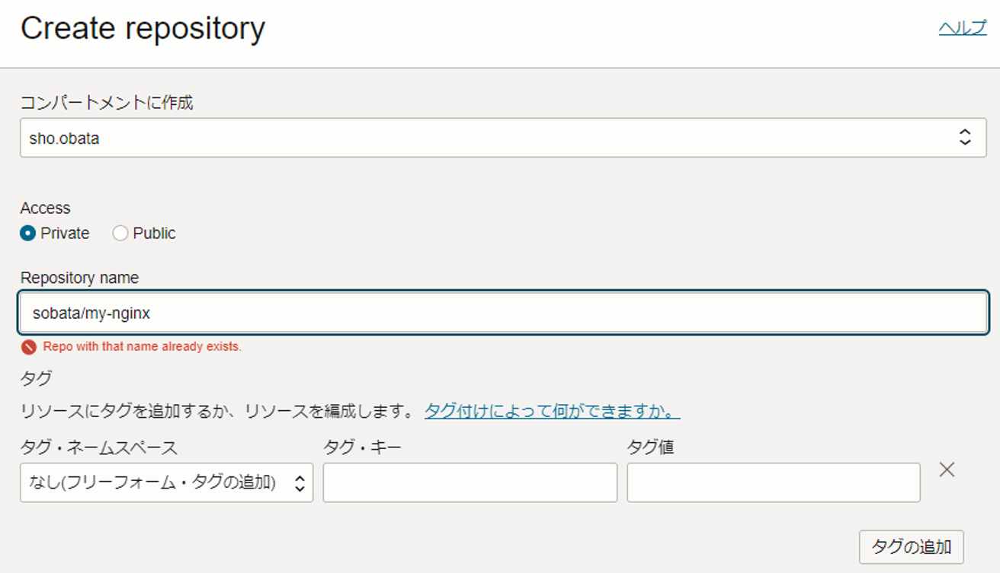
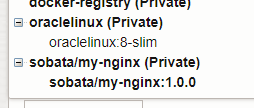

# 4. nrt.ocir.io/orasejapan/…/my-nginx:1.0.0をOCIRにpushする

OCIRにRepositoryを作成する。



`docker image ls`でイメージを確認する。
```console
$ docker image ls
REPOSITORY                                                  TAG       IMAGE ID       CREATED        SIZE
nginx                                                       latest    b690f5f0a2d5   3 months ago   187MB
phx.ocir.io/<tenancy-namespace>/sobata/my-nginx                      1.0.0     b690f5f0a2d5   3 months ago   187MB
```

`docker image push`でコンテナイメージをpushする。
```console
$ docker image push phx.ocir.io/<tenancy-namespace>/sobata/my-nginx:1.0.0
```

OCIRのRepositoryにimageが追加されたことを確認する。


