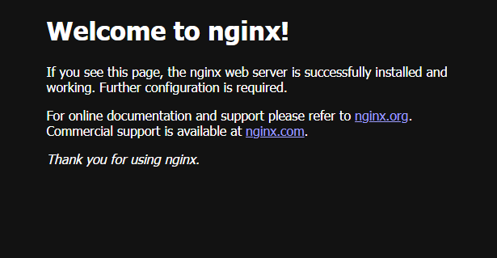

# 5. nrt.ocir.io/orasejapan/…/my-nginx:1.0.0を動かし、デフォルトのHTMLを表示させる

'my-nginx'のコンテナを起動する。
```console
$ docker container run -d -p 8080:80 --name my-nginx phx.ocir.io/orasejapan/sobata/my-nginx:1.0.0 
```

起動しているコンテナを確認する。
```console
$ docker container ls
CONTAINER ID   IMAGE                                          COMMAND                  CREATED         STATUS         PORTS                                   NAMES
da0e3be5de7e   phx.ocir.io/orasejapan/sobata/my-nginx:1.0.0   "/docker-entrypoint.…"   2 minutes ago   Up 2 minutes   0.0.0.0:8080->80/tcp, :::8080->80/tcp   my-nginx
```

デフォルトのHTMLを表示する
`http://<VMのIPアドレス>:8080`


