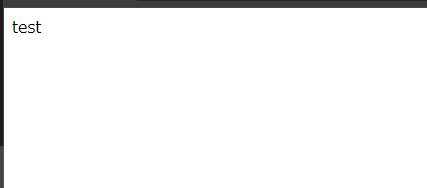

# 6. nrt.ocir.io/orasejapan/…/my-nginx:1.0.0を動かし、自分で作成した任意のHTMLを表示させる

Nginxのデフォルトのドキュメントルートを確認する。
Nginxのコンテナにログインする。

```console
$ docker run --rm -it -p  8080:80 --name my-nginx phx.ocir.io/orasejapan/sobata/my-nginx:1.0.0 bash
```

rootで設定ファイル (nginx.conf) を確認する
```
root@cad4cbc015d1:/# cat /etc/nginx/nginx.conf 

user  nginx;
worker_processes  auto;

error_log  /var/log/nginx/error.log notice;
pid        /var/run/nginx.pid;


events {
    worker_connections  1024;
}


http {
    include       /etc/nginx/mime.types;
    default_type  application/octet-stream;

    log_format  main  '$remote_addr - $remote_user [$time_local] "$request" '
                      '$status $body_bytes_sent "$http_referer" '
                      '"$http_user_agent" "$http_x_forwarded_for"';

    access_log  /var/log/nginx/access.log  main;

    sendfile        on;
    #tcp_nopush     on;

    keepalive_timeout  65;

    #gzip  on;

    include /etc/nginx/conf.d/*.conf;
}
```

`include /etc/nginx/conf.d/*.conf;`に記載の通り、`/etc/nginx/conf.d/`配下の`.conf`の拡張子が読まれている。

`/etc/nginx/conf.d/`配下には、`default.conf`というファイルがある。
```console
root@cad4cbc015d1:/# ls /etc/nginx/conf.d/
default.conf
```

`default.conf`にドキュメントルートが書かれている。(`root   /usr/share/nginx/html;`)
```console
root@cad4cbc015d1:/# cat /etc/nginx/conf.d/default.conf 
server {
    listen       80;
    server_name  localhost;

    #access_log  /var/log/nginx/host.access.log  main;

    location / {
        root   /usr/share/nginx/html;
        index  index.html index.htm;
    }

    #error_page  404              /404.html;

    # redirect server error pages to the static page /50x.html
    #
    error_page   500 502 503 504  /50x.html;
    location = /50x.html {
        root   /usr/share/nginx/html;
    }

    # proxy the PHP scripts to Apache listening on 127.0.0.1:80
    #
    #location ~ \.php$ {
    #    proxy_pass   http://127.0.0.1;
    #}

    # pass the PHP scripts to FastCGI server listening on 127.0.0.1:9000
    #
    #location ~ \.php$ {
    #    root           html;
    #    fastcgi_pass   127.0.0.1:9000;
    #    fastcgi_index  index.php;
    #    fastcgi_param  SCRIPT_FILENAME  /scripts$fastcgi_script_name;
    #    include        fastcgi_params;
    #}

    # deny access to .htaccess files, if Apache's document root
    # concurs with nginx's one
    #
    #location ~ /\.ht {
    #    deny  all;
    #}
}
```

このドキュメントルートに対して、バインドマウントして自作のページを表示させる。
まず、ページを作成する。`html_pages`ディレクトリとその下に`index.html`ファイルを作成する。

```
$ mkdir html_pages
$ touch index.html
```

`index.html`の内容を記載する。
```html
<html lang="en">
<head>
    <meta charset="UTF-8">
    <meta http-equiv="X-UA-Compatible" content="IE=edge">
    <meta name="viewport" content="width=device-width, initial-scale=1.0">
    <title>test page</title>
</head>
<body>
    test
</body>
</html>
```

作成した`html_pages`のディレクトリをドキュメントルートにバインドマウントして、コンテナを建てる。
```console
$ docker run --rm -p 8080:80 -v $(pwd):/usr/share/nginx/html -d --name my-nginx phx.ocir.io/orasejapan/sobata/my-nginx:1.0.0
```

`http://<VMのIPアドレス>:8080`にアクセスして変更を確認する。

