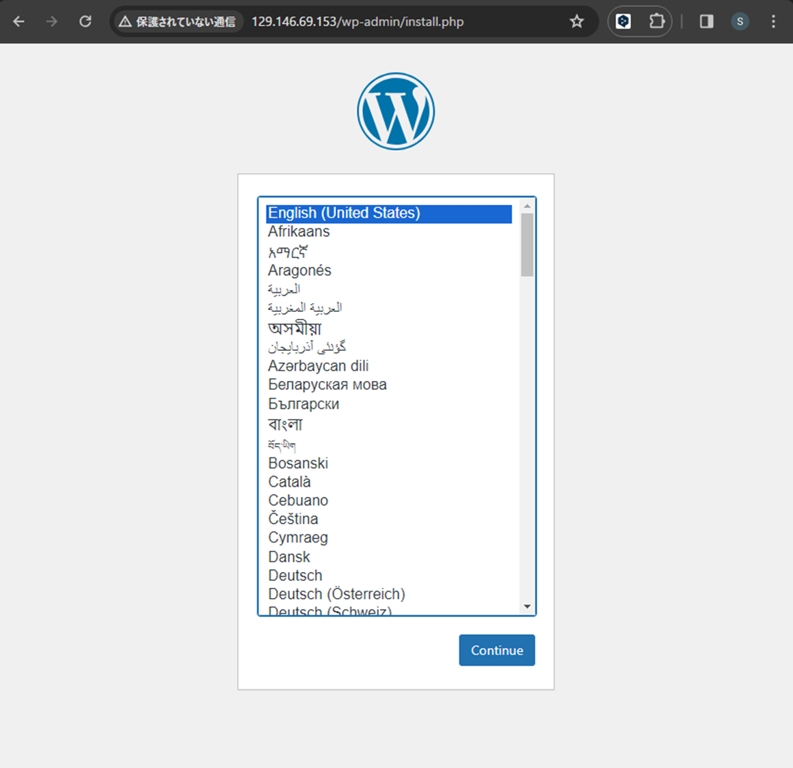

# 9. 複数コンテナをContainer Instancesで起動し、WordPressが動作することを確認してください。(wordpress:latest, mysql:5.7)

8.で使用したwordpressとmysqlのイメージを使用する。

## CLI
cliの準備として、`oci container-instances container-instance create --generate-param-json-input xxx > xxx.json`を使い以下のjsonファイルを作成する。

```console
container_instance_cli/
├── containers.json
├── shape-config.json
└── vnics.json
```

それぞれのファイルに必要な内容を記載する。
`containers.json`
```json
[
  {
    "displayName": "wordpress_ci",
    "imageUrl": "wordpress:latest",
    "isResourcePrincipalDisabled": true
  },
  {
    "displayName": "mysql_ci",
    "imageUrl": "mysql:5.7",
    "isResourcePrincipalDisabled": true
  }
]

```

`shape-config.json`
```json
{
  "ocpus": 1
}

```

`vnics.json`
```json
[
  {
    "isPublicIpAssigned": true,
    "subnetId": "ocid1.subnet.oc1.phx.aaaaxxxx"
  }
]
```

以下のコマンドでContainer Instanceを起動する。
```console
$ pwd
/home/ubuntu/cn_study_tutor_repository/3_docker/container_instance_cli

$ oci container-instances container-instance create --availability-domain TGjA:PHX-AD-1 --compartment-id $C --containers=file://./containers.json --shape CI.Standard.E4.Flex --shape-config=file://./shape-config.json --vnics=file://./vnics.json --display-name cn_container_instance --debug
```
OCIコンソールのContainer Instanceからアクセスする。



## Terraform
以下の構成でTerraformファイルを作成する。

### Terraformファイル構造
```
tf_container_instances/
├── main.tf
├── main.tfvars
├── main.tfvars.examples
├── modules
│   ├── container_instance
│   │   ├── main.tf
│   │   ├── main.tfvars
│   │   ├── outputs.tf
│   │   └── variables.tf
│   └── vcn
│       ├── outputs.tf
│       ├── variables.tf
│       ├── vcn.tf
│       └── vcn.tfvars
├── provider.tf
├── terraform.tfstate
├── terraform.tfstate.backup
└── variables.tf
```

以下のTerraformファイルでContainer Instanceを建て、wordpressとmysqlを動作させる。
(vcnもTerraformに記載しているが、既存のものを用いてもよい)

```console
terraform destroy -var-file=./main.tfvars -auto-approve
```

以下のTerraformでContainer Instanceが作成される。

### Container Instances
```
terraform {
  required_providers {
    oci = {
        source = "oracle/oci"
        version = ">= 5.0.0"
    }
  }
}

data "oci_identity_availability_domains" "ads" {
    compartment_id = "${var.compartment_id}"
}

locals {
    availability_domain_name = data.oci_identity_availability_domains.ads.availability_domains[0].name
    source_ocid = "ocid1.image.oc1.phx.aaaaaaaa6dxlvblwz5msd3cqlmuy4inpytvsbjwyecpstlvak3llgyt4oqba"
    wordpress_image_url = "wordpress:latest"
    mysql_image_url = "mysql:5.7"
    container_instance_shape = "CI.Standard.E4.Flex"
}

resource "oci_container_instances_container_instance" "mysql_container_instance" {
    availability_domain = local.availability_domain_name
    compartment_id = var.compartment_id
    display_name = var.container_instance_display_name
    
    containers {
        image_url = local.wordpress_image_url
        display_name = var.wordpress_display_name
        environment_variables = {
            "WORDPRESS_DB_HOST" = "127.0.0.1",
            "WORDPRESS_DB_USER" = var.wordpress_db_user,
            "WORDPRESS_DB_PASSWORD" = var.wordpress_db_password,
            "WORDPRESS_DB_NAME" = var.wordpress_db_name
        }
    }

    containers {
        image_url = local.mysql_image_url
        display_name = var.mysql_display_name
        environment_variables = {
            "MYSQL_ROOT_PASSWORD" = var.mysql_root_password,
            "MYSQL_USER" = var.mysql_user,
            "MYSQL_PASSWORD" = var.mysql_password,
            "MYSQL_DATABASE" = var.mysql_database
        }
    }

    container_restart_policy = "ALWAYS"
    shape = local.container_instance_shape
    shape_config {
        ocpus = 1
    }
    vnics {
        subnet_id = var.subnet_ocid
        display_name = var.display_vnic_name
    }
    volumes {
        name = var.mysql_volumes_name
        volume_type = "CONFIGFILE"
    }
}

```
