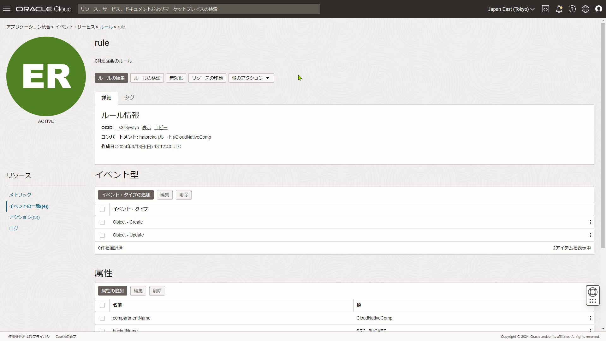
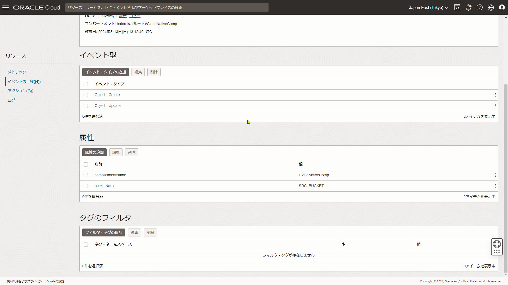
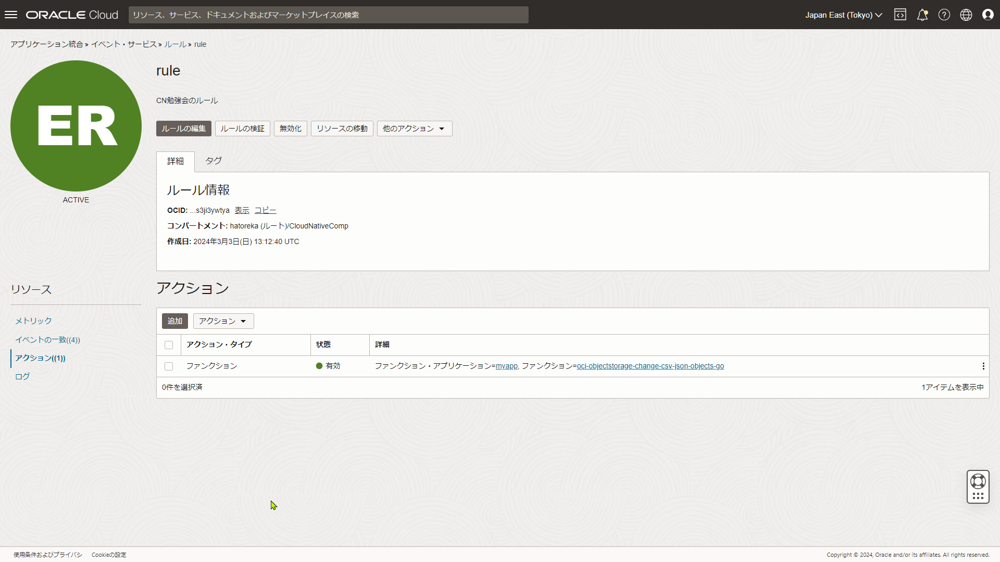
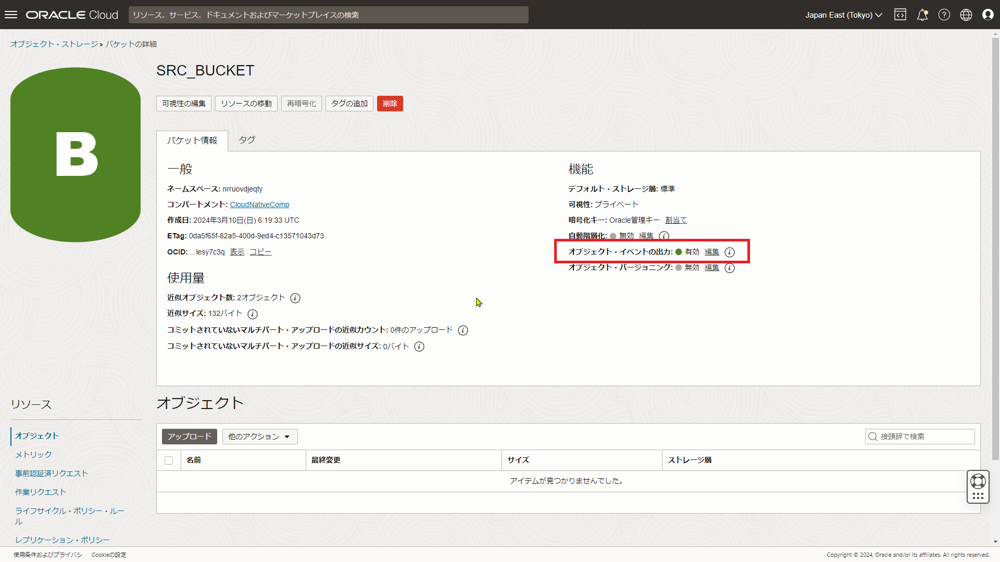
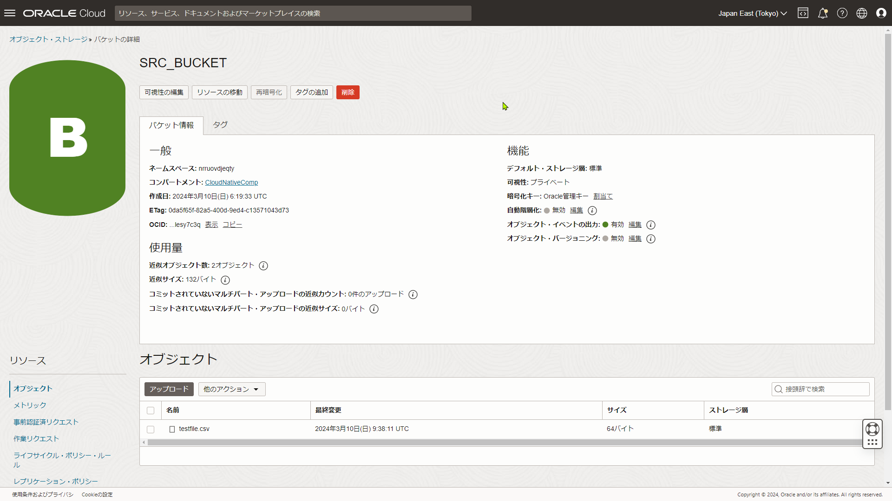
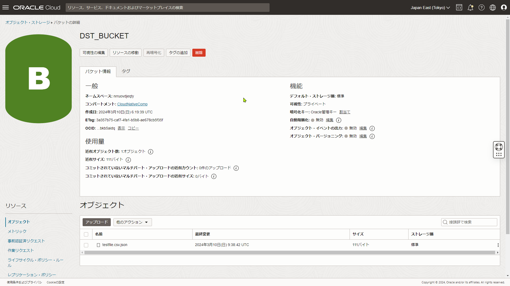

## 4-2 Function as a Serviceの基礎

### 2. Object Storage – BucketにCSVファイルが置かれたことをトリガーにOCI Functionsを実行し、そのCSVファイルをJSON形式に変換して別のBucketに格納してください(Go言語)

1. コピー元バケットとコピー先バケットを作成
   コピー元バケット: SRC_BUCKET
   コピー先バケット: DST_BUCKET

2. Dynamic Group作成
   Dynamic Group名：demo-func-dyn-group
   ```
   ALL {resource.id = 'ocid1.fnapp.oc1.ap-tokyo-1.aaaaaaaaspq4o6673eyjvgrbxz6q2u6vjbcfswo6pr6ntuj25fnr7sy6wuyq'}
   ```

3. ポリシー設定
   ```
   Allow service objectstorage-ap-tokyo-1 to manage object-family in compartment CloudNativeComp
   Allow dynamic-group demo-func-dyn-group to manage objects in compartment CloudNativeComp
   Allow dynamic-group demo-func-dyn-group to manage buckets in compartment CloudNativeComp
   ```

4. Fnプログラムを作成
   Go言語はこちら[func.go](./go_4-2/func.go)

5. Fnをデプロイ
```console
[opc@admin2-vm1 oci-objectstorage-change-csv-json-objects-go]$ ls -l
total 28
-rw-r--r-- 1 opc opc  3935 Mar 10 17:24 func.go
-rw-r--r-- 1 opc opc   187 Mar 10 17:25 func.yaml
-rw-r--r-- 1 opc opc    78 Mar 10 15:20 go.mod
-rw-r--r-- 1 opc opc   448 Mar  7 22:10 go.sum
-rw-r--r-- 1 opc opc 10819 Mar 10 07:07 memo.md
[opc@admin2-vm1 oci-objectstorage-change-csv-json-objects-go]$ 
[opc@admin2-vm1 oci-objectstorage-change-csv-json-objects-go]$ fn deploy --app myapp
Deploying oci-objectstorage-change-csv-json-objects-go to app: myapp
Bumped to version 0.0.34
Using Container engine docker
Building image nrt.ocir.io/nrruovdjeqty/myapp-repo-go/oci-objectstorage-change-csv-json-objects-go:0.0.34 TargetedPlatform:  amd64HostPlatform:  amd64
.............
Using Container engine  docker  to push
Pushing nrt.ocir.io/nrruovdjeqty/myapp-repo-go/oci-objectstorage-change-csv-json-objects-go:0.0.34 to docker registry...The push refers to repository [nrt.ocir.io/nrruovdjeqty/myapp-repo-go/oci-objectstorage-change-csv-json-objects-go]
d28fd45d7f8d: Layer already exists 
5093f273c9f7: Layer already exists 
c8d37778d78b: Layer already exists 
7e9f3f6c7a0a: Layer already exists 
0.0.34: digest: sha256:bdbbdd78a3658e2dbe949b6d766f6f30b22de199b58a3b9e7d609628a63f8b7a size: 1154
Updating function oci-objectstorage-change-csv-json-objects-go using image nrt.ocir.io/nrruovdjeqty/myapp-repo-go/oci-objectstorage-change-csv-json-objects-go:0.0.34...
Successfully created function: oci-objectstorage-change-csv-json-objects-go with nrt.ocir.io/nrruovdjeqty/myapp-repo-go/oci-objectstorage-change-csv-json-objects-go:0.0.34
[opc@admin2-vm1 oci-objectstorage-change-csv-json-objects-go]$ 
```

7. イベント・サービスを作成
   指定のバケット「SRC_BUCKET」にファイルのアップロード・更新が発生したときに`myapp`アプリケーションの`oci-objectstorage-change-csv-json-objects-go`を実行する設定
   
   
   

8. コピー元バケット`SRC_BUCKET`のオブジェクト・イベントの出力を有効化
   ※ オブジェクト・イベントの出力をONにしないと、イベント・サービスにイベントが送付されない
   

9. SRC_BUCKETに`testfile.csv`ファイルをアップロード
   ```
   Title1,Title2,Title3
   Hello,WORLD,Tokyo
   Good,Morning,Everyone
   ```

10. コピー先バケット`DST_BUCKET`にファイルがアップロードされてJSON形式になっていることを確認
    コピー先のファイル名は元ファイルに`.json`が付与される
    
    
    `testfile.csv.json`の中身を確認
    ```
    [{"Title1":"Hello","Title2":"WORLD","Title3":"Tokyo"},{"Title1":"Good","Title2":"Morning","Title3":"Everyone"}]
    ```  
