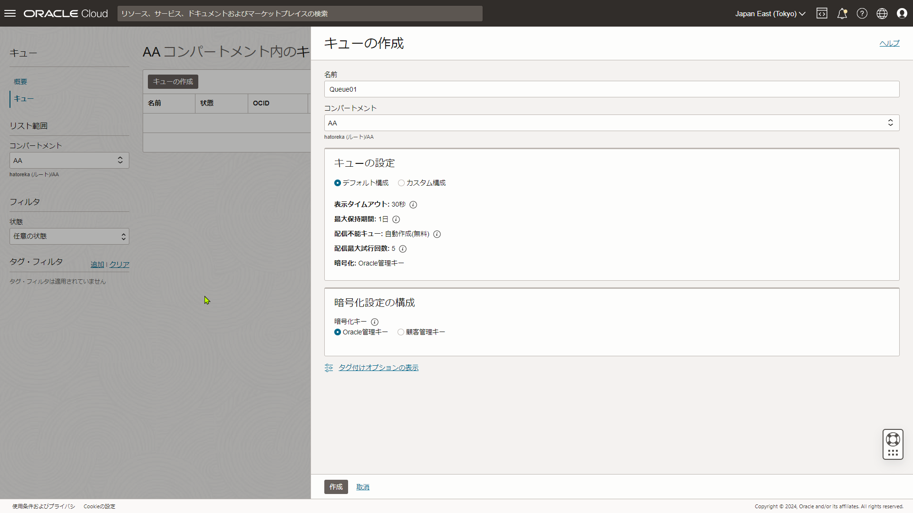

## 4-2 Function as a Serviceの基礎

### 3. OCI Queueに格納されたメッセージをOCI Connector Hubを用いてOCI Functionsに連携してください
### 3-1. Functionはそのメッセージをログに出力し、OCI Loggingから参照できるようにしてください


1. OCI Queueを作成する。
   
   
2. Queueから送付されるメッセージが配列になるので、4-1で作成したプログラムを修正する。
   [Go言語](./go_4-2-3/func.go)

3. QueueとFunctions(4-1のプログラム)を連携するするOCI Connector Hubを作成し、ロギングもONにする。
   
   
   

4. Queueテスト用メッセージファイルを作成する。
   [message.json](./go_4-2-3/message.json)

5. Queueにメッセージ送付する。このときにオプションでエンドポイントを指定する。指定しないと存在しないエンドポイントにメッセージが送信されエラーとなる。
   ```console
   [opc@admin2-vm1 func-g-queue]$ oci queue messages put-messages --from-json file://./message.json --endpoint https://cell-1.queue.messaging.ap-tokyo-1.oci.oraclecloud.com
   {
   "data": {
      "messages": [
         {
         "id": 108086391073189281
         }
      ]
   }
   }
   [opc@admin2-vm1 func-g-queue]$ 
   ```

6. OCI Logging画面でログが出力されていることを確認する。
   


### 参考
Announcing the availability of OCI Queue as a source in OCI Connector Hub
https://blogs.oracle.com/cloud-infrastructure/post/oci-queue-source-oci-connector-hub
