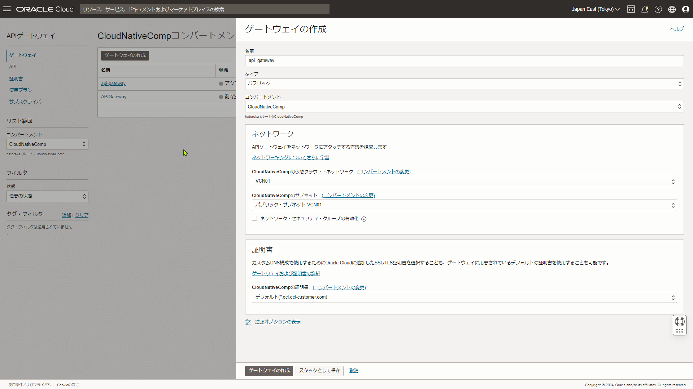

## 4-2 Function as a Serviceの基礎

### 1. API GatewayのAPIエンドポイントを実行して、#4-1(4)で作成したFunctionsが実行されるようにしてください

1. API GatewayがFunctionsを実行できるようにポリシー設定を行う。
`Allow any-user to use functions-family in compartment <Compartment>`

2. API Gatewayを作成する。
   

3. デプロイメントを作成する。
  <image src="./apiGateway02.png" width=00 border="1">

4. OCIコンソール上からデプロイメントのエンドポイントにcurlする。

```console
[opc@admin2-vm1 func-g]$ curl -X GET -H "Content-Type: application/json" -d '{"locate":"US"}' https://ibukjfueccn3k6e46kj6yywpde.apigateway.ap-tokyo-1.oci.customer-oci.com/deploy/func
-g
{"message":"Hello"}
[opc@admin2-vm1 func-g]$ curl -X GET -H "Content-Type: application/json" -d '{"locate":"Europe"}' https://ibukjfueccn3k6e46kj6yywpde.apigateway.ap-tokyo-1.oci.customer-oci.com/deploy/
func-g
{"message":"こんにちは"}
[opc@admin2-vm1 func-g]$ 
[opc@admin2-vm1 func-g]$ 
[opc@admin2-vm1 func-g]$ curl -X GET -H "Content-Type: application/json" -d https://ibukjfueccn3k6e46kj6yywpde.apigateway.ap-tokyo-1.oci.customer-oci.com/deploy/func-g
curl: no URL specified!
curl: try 'curl --help' or 'curl --manual' for more information
[opc@admin2-vm1 func-g]$ curl -X GET -H "Content-Type: application/json" https://ibukjfueccn3k6e46kj6yywpde.apigateway.ap-tokyo-1.oci.customer-oci.com/deploy/func-g
{"message":"こんにちは"}
[opc@admin2-vm1 func-g]$ 
```

### 2. Object Storage – BucketにCSVファイルが置かれたことをトリガーにOCI Functionsを実行し、そのCSVファイルをJSON形式に変換して別のBucketに格納してください
### 3. OCI Streamingに格納されたメッセージをSCHを用いてOCI Functionsに連携してください
### 3-1. Functionはそのメッセージをログに出力し、OCI Loggingから参照できるようにしてください
### 4. FunctionsからBaseDB or ADBに接続してSELECT文の結果を表示してください
