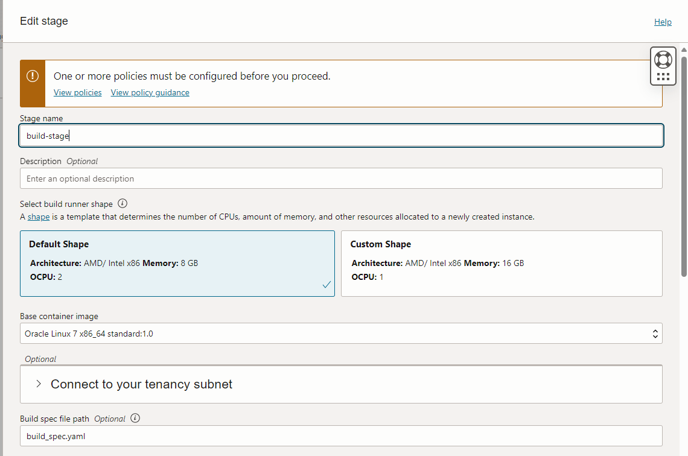

# 4-1-2で作成したFunctionsを{“message”: “Hi there”}が返却されるように修正してください
## ただし、OCI Functionsへの反映はGitHubリポジトリへの更新をトリガーにOCI DevOpsを用いて自動的に行われるようにしてください

### ■プログラムを修正(Go)

`{"message":"Hi, there"}`が戻ってくるように[func.go](./func-go/func.go)を修正

```go
package main

import (
	"context"
	"encoding/json"
	"io"
	"log"

	fdk "github.com/fnproject/fdk-go"
)

func main() {
	fdk.Handle(fdk.HandlerFunc(myHandler))
}

type Msg struct {
	Name string `json:"msg"`
}

func myHandler(ctx context.Context, in io.Reader, out io.Writer) {
	l := &Msg{}
	err := json.NewDecoder(in).Decode(l)
	log.Println(err)
	if err != nil {
		log.Printf("Error decodeing request: %v", err)
	}
	msg := struct {
		Msg string `json:"message"`
	}{}
	if l.Name == "US" {
		msg.Msg = "Hello"
	} else if l.Name == "HRU" {
		msg.Msg = "Hi there, all"
	} else {
		msg.Msg = "Hi, there"
	}
	log.Print("Inside Go Hello World function")
	log.Println(msg)
	err = json.NewEncoder(out).Encode(&msg)
	if err != nil {
		log.Printf("Error encoding response: %v", err)
	}
}
```

### ■build_spec.yaml作成

[build_spec.yaml](./func-go/build_spec.yaml)

```yaml
version: 0.1
component: build
timeoutInSeconds: 10000
shell: bash
env: 
  variables:
    image_name: func-go
    image_version: 0.0.5
  exportedVariables:
    - tag

steps:
  - type: Command
    name: "Docker image build"
    timeoutInSeconds: 600
    command: |
      cd func-go
      fn build --verbose
      docker images
      docker tag ${image_name}:${image_version} func-go-image
      tag=$(date '+%Y%m%d_%H%M%S')  # Insert date+time to tag
      docker images
    onFailure:
      - type: Command
        command: |
          echo "Failure successfully handled"
        timeoutInSeconds: 60

outputArtifacts:
  - name: func-go-image
    type: DOCKER_IMAGE
    location: func-go-image

```

### ■DevOps用のDynamic GroupとPolicy作成

#### Dynamic group作成

```
ALL {resource.type = 'devopsdeploypipeline', resource.compartment.id = 'compartmentOCID'}
ALL {resource.type = 'devopsrepository', resource.compartment.id = 'compartmentOCID'}
ALL {resource.type = 'devopsbuildpipeline',resource.compartment.id = 'compartmentOCID'}
ALL {resource.type = 'devopsconnection',resource.compartment.id = 'compartmentOCID'}
```

#### Policy作成

```
Allow dynamic-group <DevOpsDynamicGroup> to manage functions-family in compartment <compartment_name>
Allow dynamic-group <DevOpsDynamicGroup> to manage secret-family in compartment <compartment_name>
Allow dynamic-group <DevOpsDynamicGroup> to manage devops-family in compartment <compartment_name>
Allow dynamic-group <DevOpsDynamicGroup> to manage repos in compartment <compartment_name>
Allow dynamic-group <DevOpsDynamicGroup> to manage generic-artifacts in compartment <compartment_name>
Allow dynamic-group <DevOpsDynamicGroup> to manage devops-family in compartment <compartment_name>
Allow dynamic-group <DevOpsDynamicGroup> to use ons-topics in compartment <compartment_name>
```

### ■DevopsのProjectを作成


### ■GitHub連携用のTokenを作成

GitHubのTokenを作成し、Tokenをメモしておく。

[fine-grained personal access token の作成](https://docs.github.com/ja/authentication/keeping-your-account-and-data-secure/managing-your-personal-access-tokens#fine-grained-personal-access-token-%E3%81%AE%E4%BD%9C%E6%88%90)

### ■GitHub連携用のSecretを作成

GitHubのTokenをSecretとして登録する。


### ■GitHub連携用のExternal Connectionsを作成

GitHubと連携するためのExternal Connectionを作成。Validate connectionで連携取れることを確認しておく。


### ■GitHub連携用のTriggerを作成

GitHubのWebhookとDevOpsのCode repositoryの2種類あり（今回はGitHub Webhookを利用）。

#### GitHub webook

GitHubのWebhook


DevOpsのTrigger


### ■Functions連携用のEnvironmentを作成


### ■OCIR連携用のArtifactを作成


### ■Deployment Pilelineを作成


### ■Build Pilelineを作成


#### Build Stage




#### Deliver Artifact


#### Trigger Deployment


### ■デプロイする

GitHubにPushしてデプロイできるかを確認する。

## reference 
[Oracle Cloud Infrastructure(OCI) DevOpsことはじめ-Oracle Functions編-](https://oracle-japan.github.io/ocitutorials/cloud-native/devops-for-beginners-functions/)

[OCI DevOps で Oracle Functions の CI/CD - パイプライン作成編](https://qiita.com/shukawam/items/d345844fbd1e0a9c4712)
