# #4-2で作成したHelidonのアプリケーションを以下のアスキーアートが返るように修正してください
## ただし、OKEへの反映はGitHubリポジトリへの更新をトリガーにOCI DevOpsを用いて自動的に行われるようにしてください → 今回は{“message”: “Hi there”}が戻ってくるアプリケーションでもOKです！

### ■OKE用Policy更新

https://docs.oracle.com/en-us/iaas/Content/devops/using/devops_iampolicies.htm#deploy_policies

#### 下記ポリシー追加

```
Allow dynamic-group <DevOpsDynamicGroup> to read all-artifacts in compartment <compartment_name>
Allow dynamic-group <DevOpsDynamicGroup> to manage cluster in compartment <compartment_name>
```

### ■goプログラムをfn project非依存に修正

[hello.go](./go/hello.go)

```go
package main

import (
    "encoding/json"
    "log"
    "net/http"
)

type Msg struct {
    Name string `json:"msg"`
}

func main() {
    http.HandleFunc("/", handler)
    log.Println("Starting server on :8080")
    log.Fatal(http.ListenAndServe(":8080", nil))
}

func handler(w http.ResponseWriter, r *http.Request) {
    if r.Method == "GET" {
        // Handle GET request, perhaps send a default response
        json.NewEncoder(w).Encode(map[string]string{"message": "Hi, there"})
        return
    }
	var l Msg
    if err := json.NewDecoder(r.Body).Decode(&l); err != nil {
        log.Printf("Error decoding request: %v", err)
        http.Error(w, err.Error(), http.StatusBadRequest)
        return
    }
    defer r.Body.Close()

    msg := struct {
        Msg string `json:"message"`
    }{}

    switch l.Name {
    case "US":
        msg.Msg = "Hello"
    case "HRU":
        msg.Msg = "Hi there, ALL!"
    default:
        msg.Msg = "Hi, there"
    }

    log.Printf("Processed message: %v", msg)
    w.Header().Set("Content-Type", "application/json")
    if err := json.NewEncoder(w).Encode(&msg); err != nil {
        log.Printf("Error encoding response: %v", err)
        http.Error(w, err.Error(), http.StatusInternalServerError)
    }
}
```

### ■deployment.yaml作成

[deployment.yaml](./go/deployment.yaml)

```yaml
apiVersion: apps/v1 
kind: Deployment 
metadata:
  name: go
spec:
  selector: 
    matchLabels:
      app: go
  replicas: 1 
  template: 
    metadata:
      labels:
        app: go
    spec:
      containers:
      - name: go-container
        image: nrt.ocir.io/nrruovdjeqty/cn-study/go-image:${tag}
        ports:
        - containerPort: 8080
        imagePullPolicy: Always
      imagePullSecrets:
      - name: secret-hatoreka

---
apiVersion: v1
kind: Service
metadata:
  name: frontend
spec:
  type: LoadBalancer
  ports:
  - port: 80
    targetPort: 8080
    protocol: TCP
  selector:
    app: go

```

### ■Dockerfile作成

[Dockerfile](./go/Dockerfile)

```yaml
# Use the official Golang image to create a build artifact.
FROM golang:1.18 as builder

# Set the working directory inside the container.
WORKDIR /app

# Copy go mod files and download dependencies.
COPY go.mod ./
RUN go mod download

# Copy the source code into the container's work directory.
COPY . .

# Build the application. Disable CGO and compile for Linux.
RUN CGO_ENABLED=0 GOOS=linux go build -v -o server

# Use a lightweight Docker image (scratch) for running the app.
FROM scratch

# Copy the compiled binary from the builder stage.
COPY --from=builder /app/server /server

# Expose port 8080 for the application.
EXPOSE 8080

# Command to run the binary.
ENTRYPOINT ["/server"]
```

### ■build_spec.yaml作成

[build_spec.yaml](./go/build_spec.yaml)

```yaml
# https://docs.oracle.com/ja-jp/iaas/Content/devops/using/build_specs.htm
# build runner config
version: 0.1
component: build
timeoutInSeconds: 10000
shell: bash
env: 
  variables:
    image_name: go-test
    image_version: 0.0.5
  exportedVariables:
    - tag

steps:
  - type: Command
    name: "Docker image build"
    timeoutInSeconds: 600
    command: |
      cd go
      docker build -t ${image_name}:${image_version} .
      docker images
      docker tag ${image_name}:${image_version} go-image
      tag=$(date '+%Y%m%d_%H%M%S')  # Insert date+time to tag
      docker images
    onFailure:
      - type: Command
        command: |
          echo "Failure successfully handled"
        timeoutInSeconds: 60

outputArtifacts:
  - name: go-image
    type: DOCKER_IMAGE
    location: go-image
  - name: deployment_yaml
    type: BINARY
    location: go/deployment.yaml
```

### ■GitHub Webhook作成（前提：GitHub連携用Secret登録は7-1で実施済み）

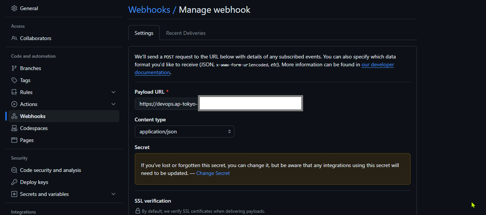

### ■GitHub用Trigger作成

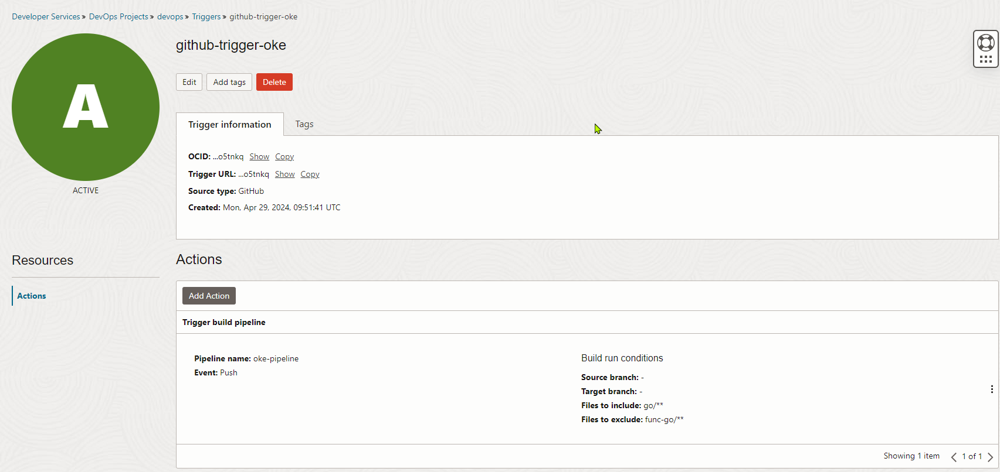

### ■deployment.yaml用Artifact repository作成

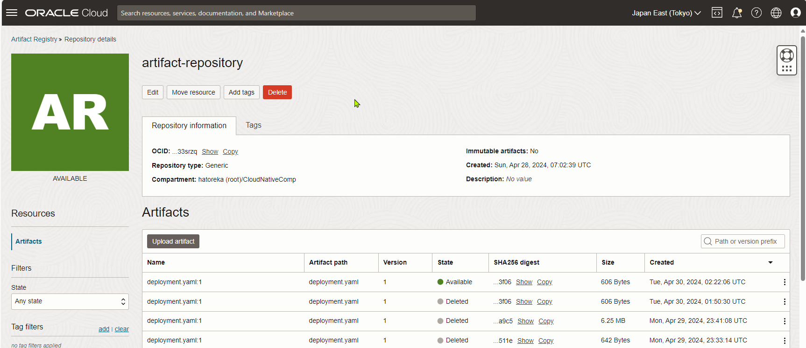

### ■K8s Manifest用Artifact作成

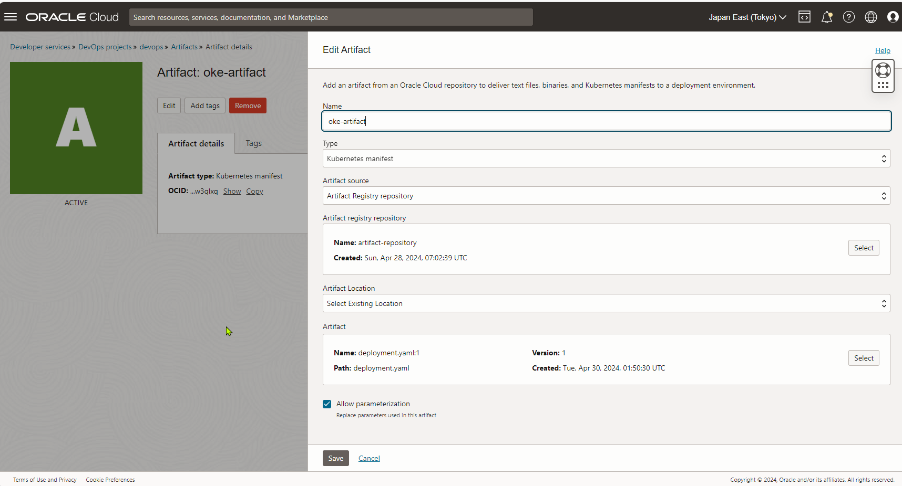

### ■OCIR用Artifact作成

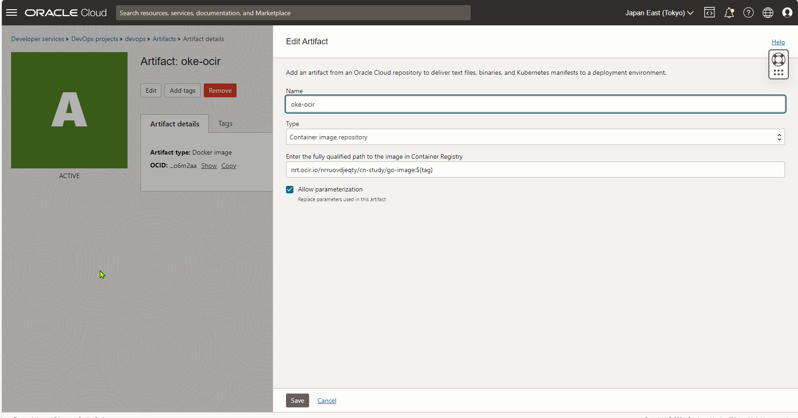

### ■OKE用Environment作成

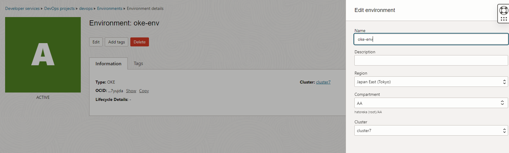

### ■Deployment Pipeline作成

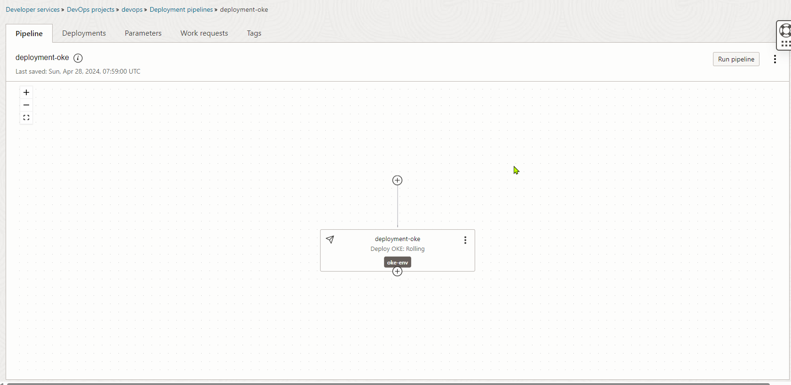

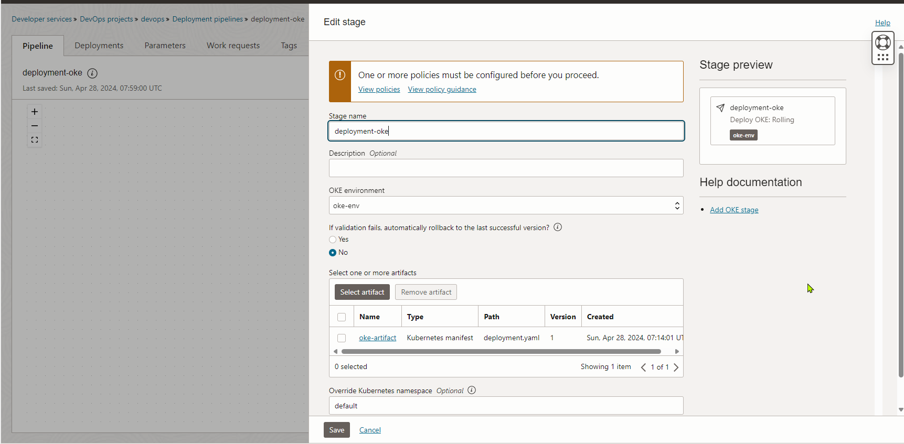

### ■Build Pipeline作成

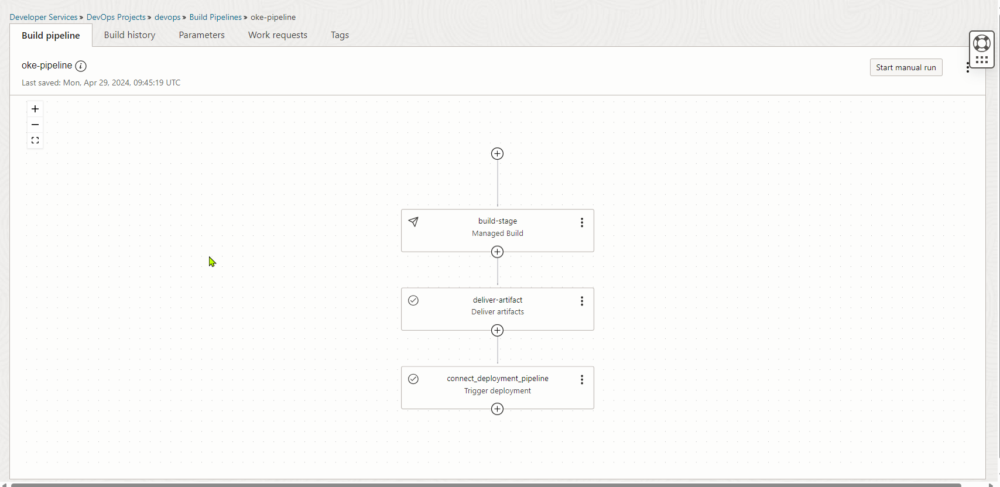

#### Build stage

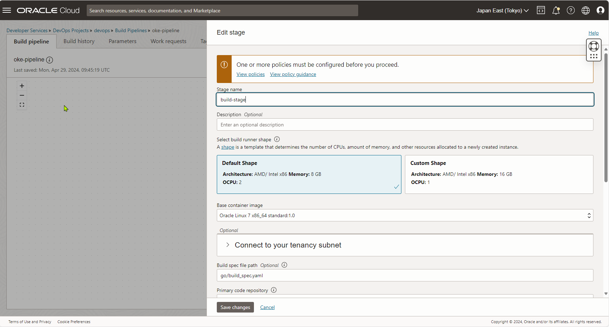

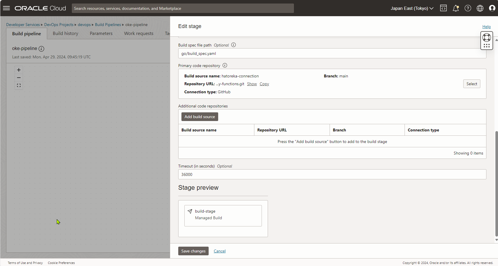

#### Deliver artifact

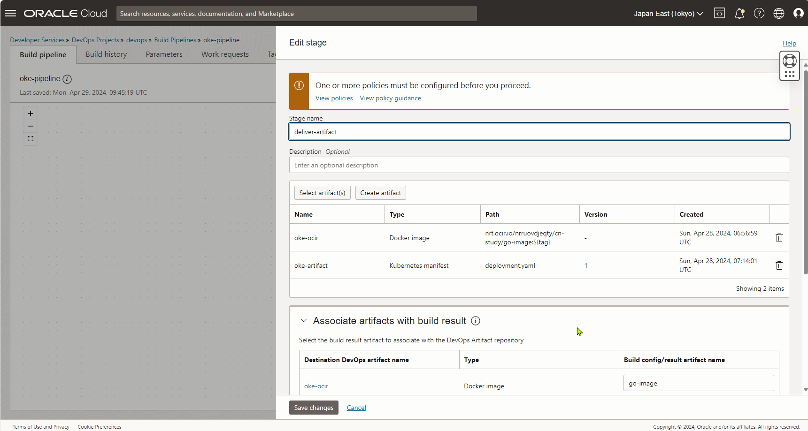

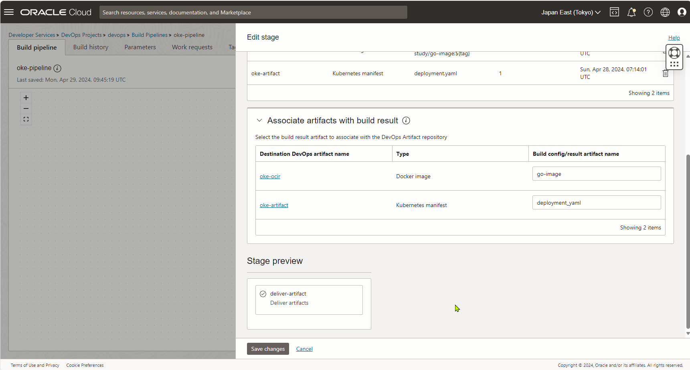

#### Connect deployment pipeline

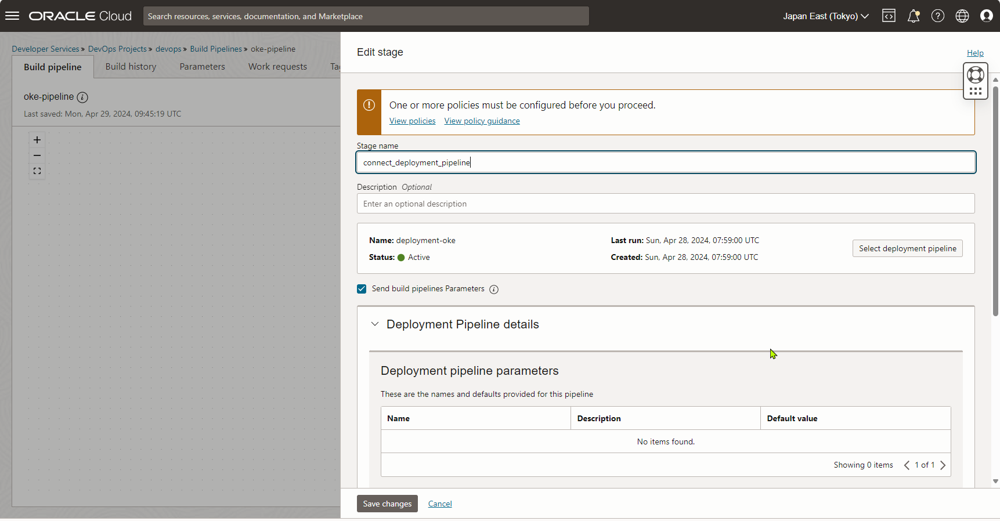

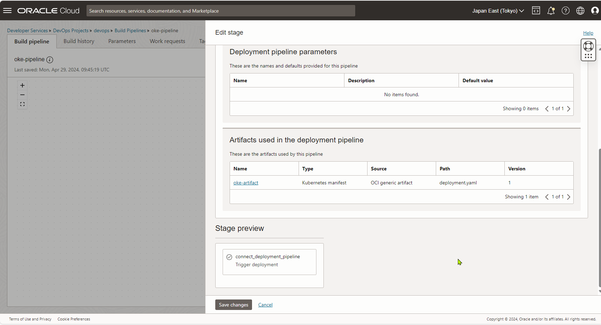

### ■デプロイする

GitHubにPushしてデプロイできるかを確認する。
