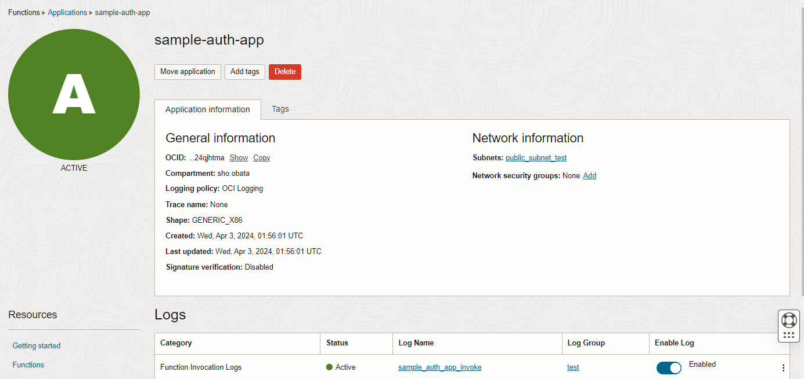
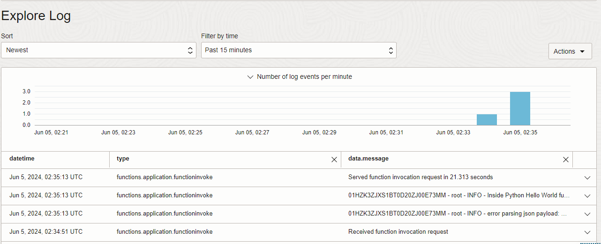
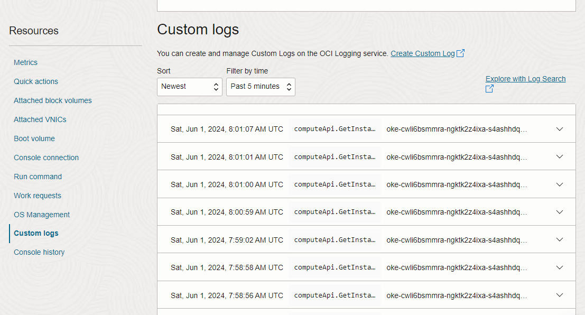
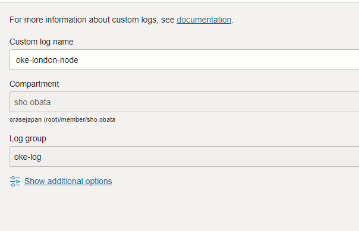
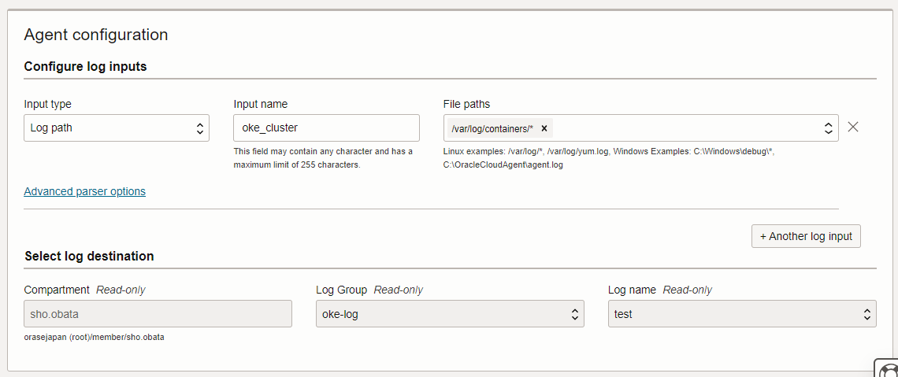
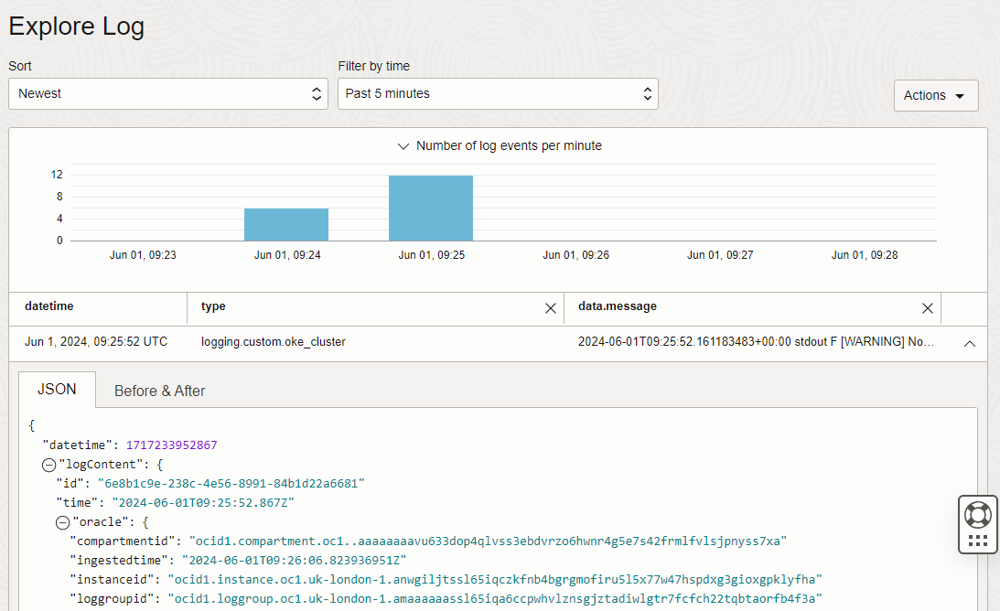

# Logging編

## OCI FunctionsのログをOCI Loggingから参照できるようにしてください
OCI FunctionsのLogを有効化する。



適当なfunctionsを起動させる。
```python
$ fn invoke sample-auth-app sample-auth-func
{'secret content': 'sample-secret-contents'}
```

Logが取れる。


以上


## #6でOKE上にデプロイした各種アプリケーションの実行ログをOCI Loggingから参照できるようにしてください

OCI Loggingを使い以下のLogを確認する。
* NodeのLog
* アプリケーションのLog

### NodeのLog
NodeのLogを確認する。
NodeとなるVMのCustom Logsを見ることで確認ができる。


このLogからはNodeへのヘルスチェックなどのNodeに対するLogを取得することができる。


### アプリケーションのLog
次に、アプリケーションログを取得する。
Observability & Management > Logsを選択する。
以下のようにカスタムログを作成する。
（必要なポリシーは各自追加する。）



次に、logが格納されるpathを設定する。pathは`/var/log/containers/*`を記載する。


podのアプリケーションログがOCI Loggingで取得できる。


このLogからはアプリケーションの通信やコンテナ内のLogが取得できる。

以上
