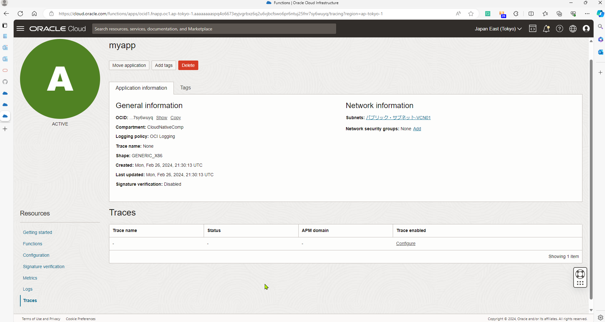
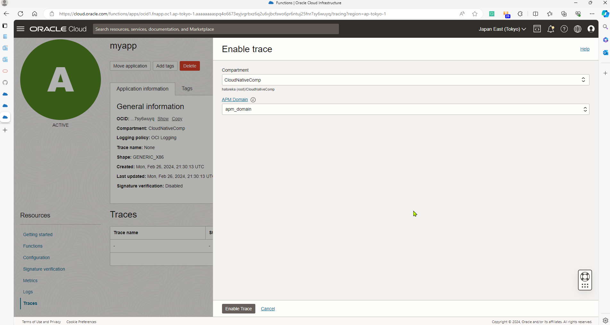
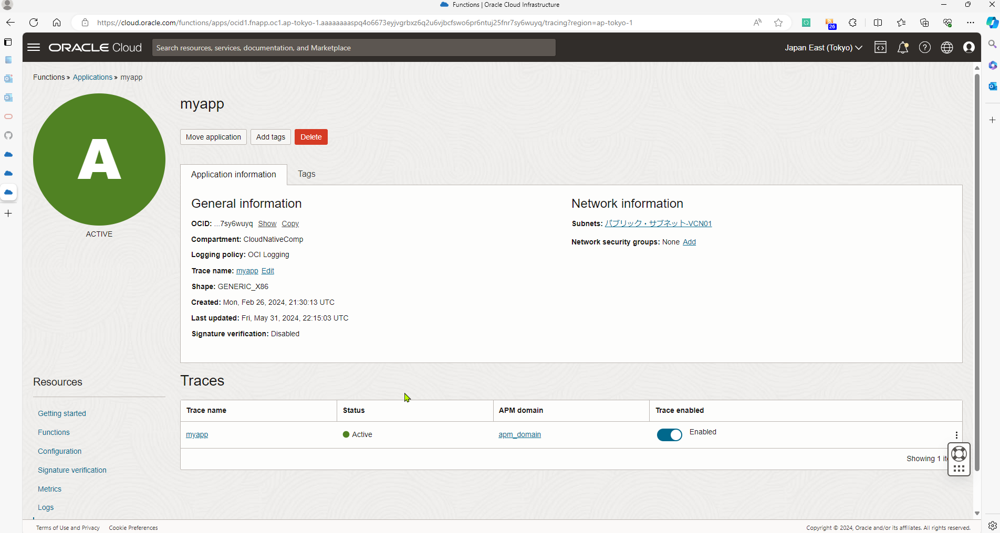
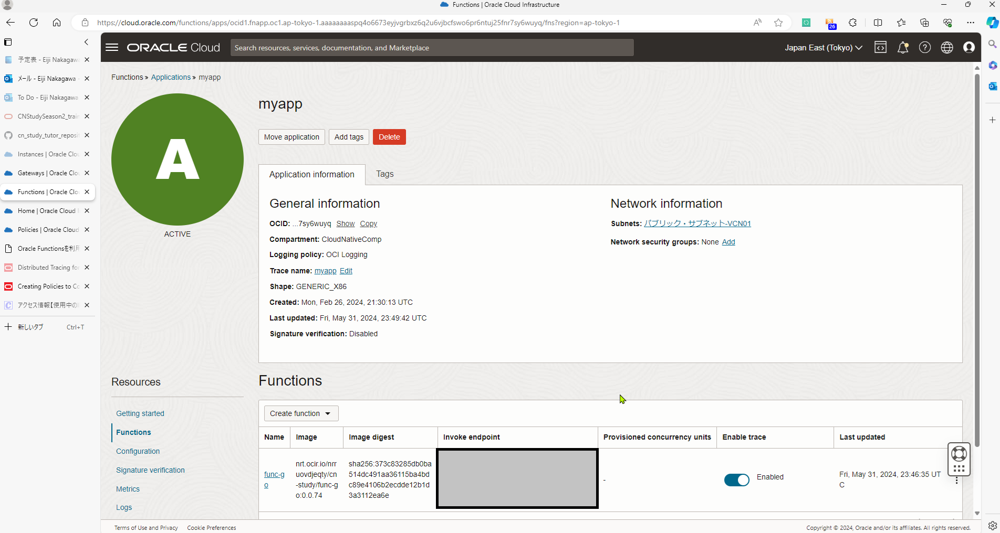
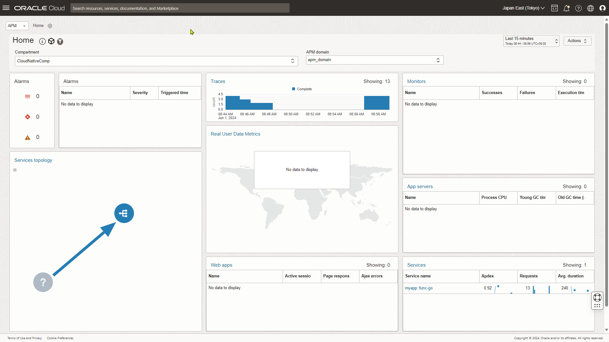

# 4-2(1)で作成したアプリケーションのトレーシング情報をAPMから参照できるようにしてください

## 過去のお題

### #4-1 Function as a Serviceの基礎
1. ローカル（自分のVM）と東京リージョンでFunctionsの開発ができる環境を整えてください
2. 実行すると、{“message”: “こんにちは”}と返すFunctionを実装し、ローカルで実行してください
3. で作成したFunctionを以下のように修正してください
   {“locate”: “US”}を受け取った際に、{“message”: “Hello”}を返す
   入力がない場合は、{“message”: “こんにちは”}を返す
4. で作成したFunctionをOCI Functionsとして実行してください

### #4-2 Function as a Serviceの基礎
1. API GatewayのAPIエンドポイントを実行して、#4-1(4)で作成したFunctionsが実行されるようにしてください

---

## 1. IAMポリシーの設定

参考URL：https://docs.oracle.com/en-us/iaas/Content/Functions/Tasks/functionscreatingpolicies.htm#usertracingpolicy

以下ポリシーを追加する
```
Allow service faas to use apm-domains in tenancy|compartment <compartment-name>
```

## 2. APM Domain作成

OCIコンソール操作によるAPM Domain作成は以下を参照

https://docs.oracle.com/en-us/iaas/application-performance-monitoring/doc/create-apm-domain.html

## 3. FunctionsのTracesにAPM Domainを登録







## 4. FunctionsのTraceを有効化



## 5. API Gateway経由でFunctionsを実行する

```console
curl -X GET -H "Content-Type: application/json" -d '{"locate":"US"}' https://ibukjfueccn3k6e46kj6yywpde.apigateway.ap-tokyo-1.oci.customer-oci.com/deploy/func-go
```

## 6. APM Monitoring画面を確認する



---

# 5で作成したHelidon or Micronautのアプリケーションのトレーシング情報をAPMで参照できるようにしてください

## 過去のお題

### #5 Helidon or Micronautの基礎

#### 前提
* Helidonもしくは、Micronautは実装時点の最新バージョンを使用してください
* /health, /metricsについては、別のパスで実行されるように実装してもOKです

#### 以下のような条件を満たすアプリケーションをHelidonまたはMicronautで実装してください
1. curl http://localhost:8080/health を実行すると、{“status”: “UP”, ”checks”: []}と返却される
2. curl http://localhost:8080/metrics を実行すると、アプリケーションのメトリクス情報が返却される
3. curl http://localhost:8080/greet を実行すると、{“message”: “Hello world”}と返却される
4. 上記のアプリケーションをExecutable JARとして実行してください
5. 上記のアプリケーションをコンテナとして実行してください

---
